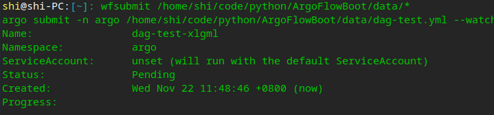
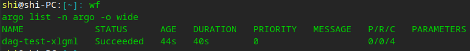
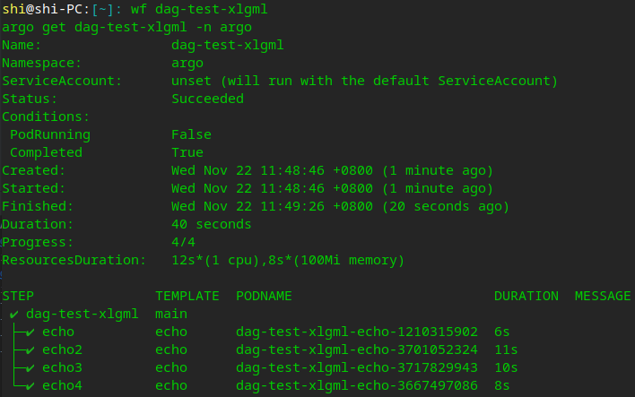
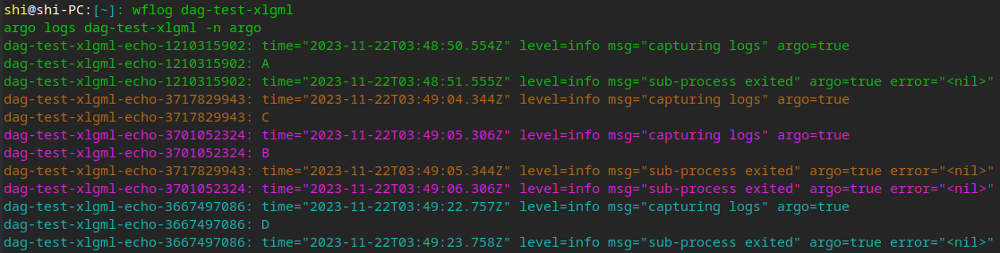

[GitHub](https://github.com/shigebeyond/ArgoFlowBoot) | [Gitee](https://gitee.com/shigebeyond/ArgoFlowBoot)

# ArgoFlowBoot - 简化Argo Workflows工作流定义文件

## 1 概述
Argo Workflows工作流定义蛮复杂的，学习与使用成本很高，大部分伙伴很难学会，因此创作了ArgoFlowBoot工具，支持通过简化版的yaml配置来生成argo最终的工作流定义文件，yaml的代码量大大缩小；

框架通过编写简单的yaml, 就可以执行一系列复杂的操作步骤, 如打印变量/生成wf/cwf/wft/cwft等工作流文件，极大的简化了伙伴编写argo工作流定义文件的工作量与工作难度，大幅提高人效；

框架通过提供类似python`for`/`if`/`break`语义与变量赋值等步骤动作，赋予伙伴极大的开发能力，让工作流定义文件的编写工作更具灵活性，能适用于广泛的应用场景。

框架提供`include`机制，用来加载并执行其他的步骤yaml，一方面是功能解耦，方便分工，一方面是功能复用，提高效率与质量，从而推进脚本整体的工程化。

## 2 特性
1. 支持通过yaml来配置执行的步骤，简化了生成代码的开发:
每个步骤可以有多个动作，但单个步骤中动作名不能相同（yaml语法要求）;
动作代表argo的某个工作流或模板定义，如wf/cwf/wft/cwft等等;
2. 支持类似python`for`/`if`/`break`语义的步骤动作，灵活适应各种场景
3. 支持`include`引用其他的yaml文件，以便解耦与复用
4. yaml的代码量大大缩小，ArgoFlowBoot的yaml代码量相当于argo工作流文件的1/3~1/10
5. 支持以函数形式来定义模板与调用模板，让argo工作流定义更加切合面向函数编程的方式
```yaml
- wf(steps-test):
    - templates:
        whalesay(msg): # 定义模板(函数形式)，带参数
            container:
              command: cowsay $msg
        main(): # 定义入口模板(函数形式)
            steps:
            - - whalesay(hello1) # 调用模板(函数调用形式)
            - - whalesay(hello2)
              - whalesay(hello3)
```

## 3 搭配argo命令简化框架，使用更简单
[k8scmd之简化argo命令](https://github.com/shigebeyond/k8scmd/blob/master/argo-cmd.md)：对argo的复杂命令做了大量简化

## 4 同类yaml驱动框架
* [HttpBoot](https://github.com/shigebeyond/HttpBoot) yaml驱动http接口自动化测试+性能测试
* [SeleniumBoot](https://github.com/shigebeyond/SeleniumBoot) yaml驱动Selenium测试
* [AppiumBoot](https://github.com/shigebeyond/AppiumBoot) yaml驱动Appium测试
* [MiniumBoot](https://github.com/shigebeyond/MiniumBoot) yaml驱动Minium测试
* [ExcelBoot](https://github.com/shigebeyond/ExcelBoot) yaml驱动Excel生成
* [MonitorBoot](https://github.com/shigebeyond/MonitorBoot) yaml驱动linux系统监控与jvm性能监控与告警
* [SparkBoot](https://github.com/shigebeyond/SparkBoot) yaml驱动Spark开发
* [K8sBoot](https://github.com/shigebeyond/K8sBoot) 简化k8s资源定义文件
* [ArgoFlowBoot](https://github.com/shigebeyond/ArgoFlowBoot) 简化Argo Workflows工作流定义文件

## 5 todo
1. 支持更多的动作

## 6 安装
```
pip3 install ArgoFlowBoot
```

安装后会生成命令`ArgoFlowBoot`;

注： 对于深度deepin-linux系统，生成的命令放在目录`~/.local/bin`，建议将该目录添加到环境变量`PATH`中，如
```
export PATH="$PATH:/home/shi/.local/bin"
```

## 7 使用
```
# 1 执行单个文件
ArgoFlowBoot 步骤配置文件.yml

# 2 执行多个文件
ArgoFlowBoot 步骤配置文件1.yml 步骤配置文件2.yml ...

# 3 执行单个目录, 即执行该目录下所有的yml文件
ArgoFlowBoot 步骤配置目录

# 4 执行单个目录下的指定模式的文件
ArgoFlowBoot 步骤配置目录/step-*.yml
```

如执行 `ArgoFlowBoot example/base/dag-test.yml -o data/`，输出如下
```
shi@shi-PC:[~/code/python/ArgoFlowBoot]: ArgoFlowBoot example/base/dag-test.yml -o data/
/home/shi/.local/lib/python3.7/site-packages/google/auth/__init__.py:55: Python37DeprecationWarning: After January 1, 2024, new releases of this library will drop support for Python 3.7. More details about Python 3.7 support can be found at https://cloud.google.com/python/docs/python37-sunset/
  warnings.warn(message, Python37DeprecationWarning)
/home/shi/.local/lib/python3.7/site-packages/google/oauth2/__init__.py:40: Python37DeprecationWarning: After January 1, 2024, new releases of this library will drop support for Python 3.7. More details about Python 3.7 support can be found at https://cloud.google.com/python/docs/python37-sunset/
  warnings.warn(message, Python37DeprecationWarning)
2023-11-22 11:22:04,295 - ThreadPoolExecutor-0_0        - boot - DEBUG - Load and run step file: /home/shi/code/python/ArgoFlowBoot/example/base/dag-test.yml
2023-11-22 11:22:04,303 - ThreadPoolExecutor-0_0        - boot - DEBUG - handle action: wf(dag-test)=[{'templates': {'echo(msg)': {'container': {'command': 'echo $msg'}}, 'main()': {}}}]
2023-11-22 11:22:04,303 - ThreadPoolExecutor-0_0        - boot - DEBUG - handle action: templates={'echo(msg)': {'container': {'command': 'echo $msg'}}, 'main()': {}}
2023-11-22 11:22:04,303 - ThreadPoolExecutor-0_0        - boot - INFO - 流程[dag-test]的定义文件已生成完毕, 如要提交到到集群中请手动执行: argo submit /home/shi/code/python/ArgoFlowBoot/data/dag-test.yml
```
命令会自动操作并生成argo工作流文件
```
shi@shi-PC:[~/code/python/ArgoFlowBoot]: tree data
data
└── dag-test.yml
```

## 8 步骤yaml详解
支持通过yaml文件来配置执行的步骤;

每个步骤可以有多个动作，但单个步骤中动作名不能相同（yaml语法要求）;

动作代表argo上的一种资源或动作，如wf/cwf/wft/cwft等等;

下面详细介绍每个动作

### 8.1 基本动作
1. ns：设置当前 namespace
```yaml
ns: 命名空间名
```

2. wf：定义流程，并执行子步骤
```yaml
wf(流程名):
	# 子步骤
	templates: ...
```
     
3. wft：定义流程模板，并执行子步骤
```yaml
wft(流程模板名):
	# 子步骤
	templates: ...
```
     
4. cwft：定义集群级流程模板，并执行子步骤
```yaml
cwft(流程模板名):
	# 子步骤
	templates: ...
```
     
5. cwf：定义定时流程，并执行子步骤；注意其下必须包含`cron`子动作
```yaml
cwf(定时流程名):
	# 子步骤
	templates: ...
	cron: ...
```

6. bind_event: 流程绑定事件
```yaml
# 流程绑定事件(绑定名) -- 触发流程模板
- bind_event(test-event):
    # discriminator与selector二选一
    # discriminator: test-event # 事件鉴别器，用于区分事件类型，可省，默认为绑定名
    # selector: discriminator == "test-event" # 事件选择器，与discriminator只能存在一个
    wft: my-wft(payload.message) # 事件触发的流程模板
```
测试，参考[event文档](https://argoproj.github.io/argo-workflows/events/)
```
ARGO_TOKEN="Bearer $(kubectl get secret default.service-account-token -n argo -o=jsonpath='{.data.token}' | base64 --decode)"
curl https://10.105.1.242:2746/api/v1/events/argo/test-event \
  -H "Authorization: $ARGO_TOKEN" \
  -d '{"message": "hello"}'
  -k
```


7. include_argo_wft: 加载argo流程模板原生文件，主要是为了获知其入参
```yaml
include_argo_wft: ./hello-wft.yml
```

8. print: 打印, 支持输出变量/函数; 
```yaml
# 调试打印
print: "总申请数=${dyn_data.total_apply}, 剩余份数=${dyn_data.quantity_remain}"
```

9. set_vars: 设置变量; 
```yaml
set_vars:
  name: shi
  password: 123456
  birthday: 5-27
```

10. print_vars: 打印所有变量; 
```yaml
print_vars:
```

11. for: 循环; 
for动作下包含一系列子步骤，表示循环执行这系列子步骤；变量`for_i`记录是第几次迭代（从1开始）,变量`for_v`记录是每次迭代的元素值（仅当是list类型的变量迭代时有效）
```yaml
# 循环3次
for(3) :
  # 每次迭代要执行的子步骤
  - print: $for_v

# 循环list类型的变量urls
for(urls) :
  # 每次迭代要执行的子步骤
  - print: $for_v

# 无限循环，直到遇到跳出动作
# 有变量for_i记录是第几次迭代（从1开始）
for:
  # 每次迭代要执行的子步骤
  - break_if: for_i>2 # 满足条件则跳出循环
    print: $for_v
```

12. once: 只执行一次，等价于 `for(1)`; 
once 结合 moveon_if，可以模拟 python 的 `if` 语法效果
```yaml
once:
  # 每次迭代要执行的子步骤
  - moveon_if: for_i<=2 # 满足条件则往下走，否则跳出循环
    print: $for_v
```

13. break_if: 满足条件则跳出循环; 
只能定义在for/once循环的子步骤中
```yaml
break_if: for_i>2 # 条件表达式，python语法
```

14. moveon_if: 满足条件则往下走，否则跳出循环; 
只能定义在for/once循环的子步骤中
```yaml
moveon_if: for_i<=2 # 条件表达式，python语法
```

15. if/else: 满足条件则执行if分支，否则执行else分支
```yaml
- set_vars:
    txt: '进入首页'
- if(txt=='进入首页'): # 括号中包含的是布尔表达式，如果表达式结果为true，则执行if动作下的子步骤，否则执行else动作下的子步骤
    - print: '----- 执行if -----'
  else:
    - print: '----- 执行else -----'
```

16. include: 包含其他步骤文件，如记录公共的步骤，或记录配置数据(如用户名密码); 
```yaml
include: part-common.yml
```

### 8.2 流程作用域下的子动作
以下的动作，必须声明在 wf/wft/cwft/cwf 动作的子步骤中，动作的参数支持传递变量;

17. labels：设置应用标签
```yaml
labels: 
    flow: test
    flow2: $flow # 支持传递变量
```

18. args: 定义流程级传参 
```yaml
- wft(hello-world-wft): # 流程模板
    - args: # 流程级参数
        # 参数名: 参数值
        msg: hello world # 普通参数
        '@hello': /tmp/hello_world.txt # 工件名: 挂载路径
```
如果参数名以`@`开头则为artifact参数，否则为普通参数
    
19. templates: 定义函数模板
```yaml
- wf(steps-test):
    - templates:
        whalesay(msg): # 定义模板(函数形式)，带参数
            container:
              command: cowsay $msg
        main(): # 定义入口模板(函数形式)，工作流入口必然是main，要放最后
            steps:
            - - whalesay(hello1) # 调用模板(函数调用形式)
            - - whalesay(hello2)
              - whalesay(hello3)
```

20. vc_templates: 定义持久卷声明
```yaml
- wf(vol-test):
	# key是vc模板名, value是{size, mount}
    - vc_templates: # 共享的pvc, 所有任务的容器都会挂载
          workdir: # pvc名
            size: 1Gi # 空间大小
            mount: /code # 挂载路径
```

其中mount可以是str类型，表示整体挂载到容器中的路径名；也可以是dict类型，key是pvc子路径，value是挂载到容器内路径，下面是dict类型的demo:
```
- wft(ci-workflowtemplate):
    - args:
        branch: master
    - vc_templates: # 共享的pvc, 所有任务的容器都会挂载
        workdir: # pvc名
          size: 64Mi # 空间大小
          mount: # 挂载路径
            mod: /go/pkg/mod
            cache: /root/.cache/go-build
            src: /src
```

21. cron: 定义定时选项，需定义在 `cwf` 动作下作为子动作
```yaml
- wf(cron-test):
    - cron: # 定时选项
          schedule: "* * * * *"
          concurrencyPolicy: "Replace"
          startingDeadlineSeconds: 0
```

22. spec: 定义流程的其他配置
```yaml
- wf(timeouts-test):
    - spec:
        activeDeadlineSeconds: 5 # terminate workflow after 5 seconds
```

## 9 模板语法
### 9.1 特殊模板名的约定
1. 入口(entrypoint)模板名必然是`main`，要定义在templates中的最后

2. 退出处理(exit handler)模板名必然是`onexit`，也要定义在templates中的最后

### 9.2 模板定义
1. 模板是定义在`templates`动作下，如
```yaml
- templates: # templates动作参数是模板dict，key是模板名+参数名(函数形式)，value是模板具体定义
    whalesay(msg): # 定义模板(函数形式)，带参数
        container:
          command: cowsay $msg
```

2. 基本语法：以函数形式来定义模板，格式如`模板名(参数列表)`
```yaml
whalesay(): # 定义模板 whalesay，不带参数
    container:
      command: cowsay hello

whalesay2(msg): # 定义模板 whalesay2，带参数
    container:
      command: cowsay $msg
```
上面代码定义了2个模板，分别是 whalesay 与 whalesay2

### 9.3 模板的输入参数
1. 基本语法：以函数形式来定义模板+参数，格式如`模板名(参数1,参数2)`，其中如果参数名以`@`开头则为artifact参数，否则为普通参数
```yaml
whalesay(msg,@art): # 定义模板 whalesay，带2个输入参数，分别是：普通参数为msg, artifact参数为art
    container:
      command: cowsay $msg ; cat ${@art.path} # 用 $xxx 或 ${xxx.yyy} 形式来引用参数
```

2. 入参的默认值
```yaml
whalesay2(msg=hello,@art=/tmp/message): # 定义模板 whalesay，带2个输入参数，参数都有默认值
    container:
      command: cowsay $msg ; cat ${@art.path} # 用 $xxx 或 ${xxx.yyy} 形式来引用参数
```

问题：由于用函数形式来定义模板+参数+参数默认值，如果代表参数默认值包含`,)`等特殊字符，或如果artifact参数默认值是一个dict，这会导致不满足函数定义形式，进而导致后续解析模板失败！

解决：用变量来做参数默认值，参考 [artifact-var.yml](example/base/artifact-var.yml)
```yaml
# artifact入参带默认值：通过变量的方式
- wf(artifact-var):
    - set_vars: # 定义变量
        source-opt:
            path: /src # 可省，默认路径为 /tmp/artifacts/工件名
            git:
                repo: https://gitee.com/argoproj/argo-workflows.git
                revision: "master"
    - templates: # 定义模板
        main(@source=$source-opt): # 变量用作采纳数默认值
            container:
                command: ls -l ${@source.path}
```

3. 用变量的方式来引用入参 
对模板 `whalesay(msg,@art):`, 你可以使用以下方式来引用入参:
变量`$msg` = `{{inputs.parameters.msg}}`
变量`$@art` = `{{inputs.artifacts.art}}`
变量表达式`${@art.path}` = artifacts变量`art`挂载的路径

### 9.3 模板的输出参数
1. 模板的输出参数是定义在`out`属性中
```yaml
whalesay: # 定义模板 whalesay，有2个输出参数，分别是：普通参数为msg2, artifact参数为art2
    container:
      command: echo -n hello world > /tmp/hello_world.txt
    out:
      msg2: hello world
      '@art2': /tmp/hello_world.txt # 工件名: 挂载路径(路径可省，默认路径为 /tmp/artifacts/工件名)
```

### 9.4 模板的缺省镜像
对于container/script类型模板，其中`image(镜像)`配置可省略，其缺省镜像的策略如下:

1. script类型模板，缺省镜像为 bash

2. 对container类型模板，根据不同的command参数，有不同的缺省镜像：
```
bash命令: 缺省镜像为 bash
cowsay命令: 缺省镜像为 docker/whalesay
curl命令: 缺省镜像为 appropriate/curl
其他命令：缺省镜像为 'alpine'
```

### 9.5 不同类型模板的定义语法
1. container类型模板
```yaml
main(): # 定义模板 main
    container: # container类型模板
      command: cowsay hello
```

2. script类型模板
```yaml
bash-random(): # 定义模板 bash-random 
    script: # script类型模板
      source: |
        cat /dev/urandom | od -N2 -An -i | awk -v f=1 -v r=100 '{printf "%i\n", f + r * $1 / 65536}'
```

3. python类型模板，相当于特殊的script模板 
```yaml
flip-coin(): # 定义模板 flip-coin
    python3.6: # python类型模板,支持python版本有 3.6/3.7/3.8/3.9/3.10/3.11
        #image: python:alpine3.6 # 镜像可省，各版本对应缺省镜像为 python:alpine3.6/python:alpine3.7/python:alpine3.8/python:alpine3.9/python:alpine3.10/python:alpine3.11
        source: |
            import random
            result = "heads" if random.randint(0,1) == 0 else "tails"
            print(result)
```

4. steps类型模板
```yaml
main(): # 定义模板 main
    steps: # steps类型模板 
    - - whalesay(hello1) # 调用模板(函数调用形式)
    - - whalesay(hello2)
      - whalesay(hello3)
```

步骤之间传递参数， 即引用上一步骤的输出参数，可以用变量的方式来引用：
```
whalesay(): # 定义模板 whalesay，有输出参数
    container:
      command: cowsay hello world | tee /tmp/hello_world.txt
    out:
      msg: hello
      '@art': /tmp/hello_world.txt
print-message(msg, @art): # 定义模板 print-message，有输入参数，用于接收上一步骤的输出参数
    container:
      command: echo $msg, cat ${@art.path}
main(): # 工作流入口必然是main
    steps:
    - - whalesay()
    - - print-message(${whalesay.msg}, ${whalesay.@art}) # 将上一步骤的输出参数，作为下一步骤的输入参数
```
其中
`${whalesay.msg}` = `{{steps.whalesay.outputs.parameters.msg}}`
`${whalesay.@art}` = `{{steps.whalesay.outputs.artifacts.art}}`

5. dag类型模板
```yaml
main(): # 定义模板 main
    dag: # dag类型模板
      # 简写语法: 上游的模板调用 -> 下游的模板调用
      # 同一级的多个模板调用用;分割
      - echo(A) -> echo(B);echo(C) -> echo(D)
```

6. suspend类型模板
```yaml
approve(): # 定义模板 approve
    suspend: # 暂停, 直到被resume

delay(): # 定义模板 delay
    suspend: 5 # 暂停5秒
```

7. create类型模板
```yaml
main(): # 定义模板 main
    create:
        file: ./test-config.yml # k8s资源文件
```
等价于
```yaml
main(): # 定义模板 main
    create:
      # k8s资源定义，即k8s资源文件内容
      manifest: |
        apiVersion: v1
        kind: ConfigMap
        metadata:
          generateName: test-
        data:
          some: value
```

8. apply类型模板
```yaml
main(): # 定义模板 main
    apply:
        file: ./test-config.yml # k8s资源文件
```
等价于
```yaml
main(): # 定义模板 main
    apply:
      # k8s资源定义，即k8s资源文件内容
      manifest: |
        apiVersion: v1
        kind: ConfigMap
        metadata:
          generateName: test-
        data:
          some: value
```

9. delete类型模板
```yaml
main(): # 定义模板 main
    delete:
        file: ./test-config.yml # k8s资源文件
```
等价于
```yaml
main(): # 定义模板 main
    delete:
      # k8s资源定义，即k8s资源文件内容
      manifest: |
        apiVersion: v1
        kind: ConfigMap
        metadata:
          generateName: test-
        data:
          some: value
```

10. create_wf_by_wft类型模板
```yaml
resource-without-argument(): # 定义模板 resource-without-argument
    create_wf_by_wft: hello-world-wft() # 通过流程模板来创建子流程 -- 不带参数

resource-with-argument(msg): # 定义模板 resource-with-argument
    create_wf_by_wft: hello-world-wft($msg) # 通过流程模板来创建子流程 -- 带参数
```

11. http模板
```yaml
req(): # 定义模板 req
    # http类型模板
    # 简写: curl命令
    http: curl https://list.zhonghuasuan.com/search -d type=goods&key=hello
```
等价于
```yaml
req(): # 定义模板 req
    # 完整写法
    http:
        url: https://list.zhonghuasuan.com/search
        method: POST
        body: type=goods&key=hello
```

## 10 demo
示例见源码 [example](example) 目录：

1. [input-test.yml](example/base/input-test.yml): 演示输入参数
2. [steps-test.yml](example/base/steps-test.yml): 演示steps类型模板
3. [steps-async.yml](example/base/steps-async.yml): steps类型模板异步模式
4. [dag-test.yml](example/base/dag-test.yml): 演示dag类型模板
5. [artifact-test.yml](example/base/artifact-test.yml):  演示artifact
6. [artifact-type.yml](example/base/artifact-type.yml): 演示各种类型的artifact
7. [artifact-key.yml](example/base/artifact-key.yml): 演示key-only artifact
8. [artifact-repo-ref.yml](example/base/artifact-repo-ref.yml): 演示artifact仓库引用
9. [artifact-var.yml](example/base/artifact-var.yml): 演示artifact的默认值是变量
10. [script-test.yml](example/base/script-test.yml): 演示script类型模板
11. [output-test.yml](example/base/output-test.yml): 演示输出参数
12. [secret-env+vol-test.yml](example/base/secret-env+vol-test.yml): 挂载secret与pvc
13. [loop-withitems.yml](example/base/loop-withitems.yml): 演示循环(withItems方式)
14. [loop-withparam.yml](example/base/loop-withparam.yml): 演示循环(withParam方式)
15. [loop-result.yml](example/base/loop-result.yml): 聚合循环的结果
16. [conditionals-test.yml](example/base/conditionals-test.yml): 演示when
17. [conditionals-artifacts.yml](example/base/conditionals-artifacts.yml): 演示when
18. [conditionals-parameters.yml](example/base/conditionals-parameters.yml): 演示when
19. [recursion-test.yml](example/base/recursion-test.yml): 演示递归
20. [retry-test.yml](example/base/retry-test.yml): 演示重试
21. [exit-test.yml](example/base/exit-test.yml): 演示退出处理
22. [timeouts-test.yml](example/base/timeouts-test.yml): 演示超时
23. [suspend-test.yml](example/base/suspend-test.yml): 演示suspend类型模板
24. [sidecars-test.yml](example/base/sidecars-test.yml): 演示sidecars类型模板
25. [cron-test.yml](example/base/cron-test.yml): 演示定时流程
26. [k8sres-test.yml](example/base/k8sres-test.yml): 演示k8s资源的创建
27. [http-test.yml](example/base/http-test.yml): 演示http类型模板
28. [event-test.yml](example/base/event-test.yml): 演示事件
29. [var-test.yml](example/base/var-test.yml): 演示流程级参数
30. [vol-test.yml](example/base/vol-test.yml): 演示pvc挂载
31. [wf2wf-test.yml](example/base/wf2wf-test.yml): 流程创建流程
32. [wftmpl-test.yml](example/base/wftmpl-test.yml): 演示流程模板
33. [ci.yml](example/adv/ci.yml): 演示ci
34. [ci-workflowtemplate.yml](example/adv/ci-workflowtemplate.yml): 演示ci

## 11 运行demo
接下来以 [example/base/dag-test.yml](example/base/dag-test.yml) 为案例讲解下 ArgoFlowBoot 与 [简化版argo命令](https://github.com/shigebeyond/k8scmd/blob/master/argo-cmd.md) 的使用:

1. 步骤yaml
```yaml
# example/base/dag-test.yml
- wf(dag-test):
    - templates:
        echo(msg): #
            container:
              command: echo $msg
        main(): # 工作流入口必然是main，要放最后
            dag: # 依赖关系
              - echo(A) -> echo(B);echo(C) -> echo(D)
```

2. 生成argo工作流文件
```sh
ArgoFlowBoot example/base/dag-test.yml -o data
```
生成文件 data/dag-test.yml，内容如下，其代码量是ArgoFlowBoot的yaml代码量的`54/8=6.75`倍
```yaml
# data/dag-test.yml
apiVersion: argoproj.io/v1alpha1
kind: Workflow
metadata:
  generateName: dag-test-
  labels:
    flow: dag-test
spec:
  entrypoint: main
  templates:
  - name: echo
    inputs:
      parameters:
      - name: msg
    container:
      image: alpine
      imagePullPolicy: IfNotPresent
      command:
      - /bin/sh
      - -c
      - echo {{inputs.parameters.msg}}
  - name: main
    dag:
      tasks:
      - name: echo
        template: echo
        arguments:
          parameters:
          - name: msg
            value: A
      - name: echo2
        template: echo
        arguments:
          parameters:
          - name: msg
            value: B
        dependencies:
        - echo
      - name: echo3
        template: echo
        arguments:
          parameters:
          - name: msg
            value: C
        dependencies:
        - echo
      - name: echo4
        template: echo
        arguments:
          parameters:
          - name: msg
            value: D
        dependencies:
        - echo2
        - echo3
```

3. 提交argo工作流文件
```sh
argo submit data/dag-test.yml
# 或
wfsubmit data/dag-test.yml
```


4. 查看所有流程


   
5. 查看单个流程


   
5. 查看单个流程的日志


